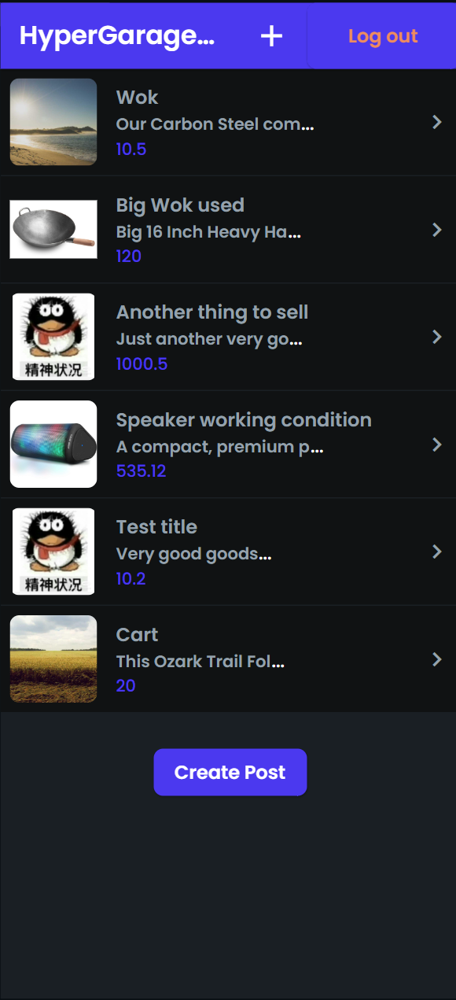
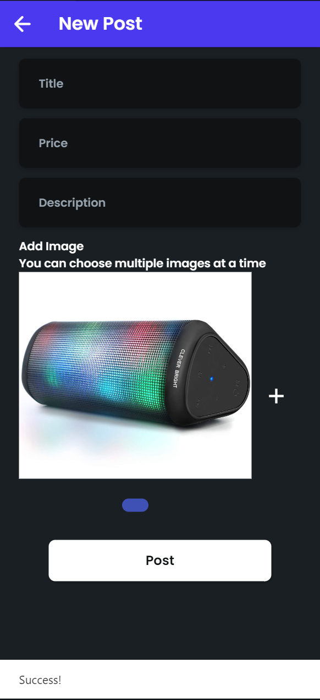
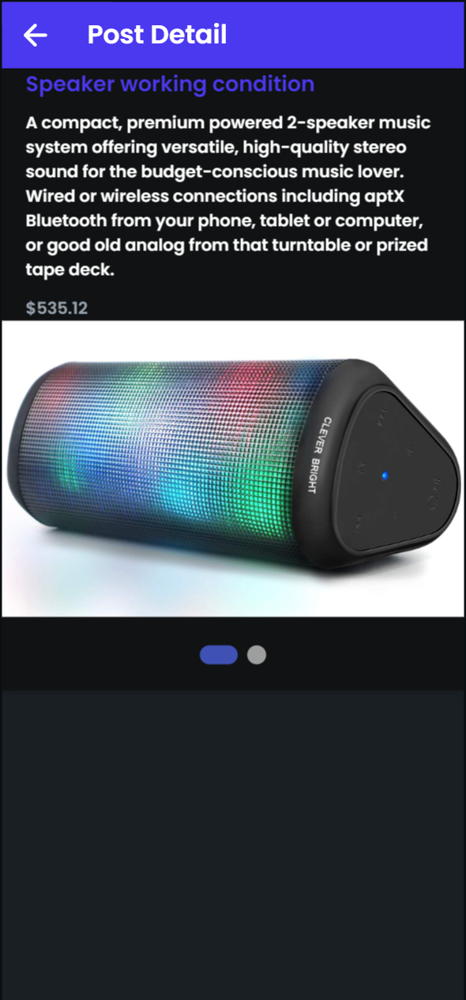

# Final Project
- Final Project name: HyperSales
- Flutter Flow URL: https://neu-2022-todo-xikai-scr35f.flutterflow.app/
- Functions:
    1. Login and logout
    2. A list view page to view all the sale posts
    3. Click on list item to view details of item
    4. Click on Plus Button to add new item
    5. Empty field check when adding new item
    6. Able to upload multiple images and view them in a scrollable widget
    7. Everything is integrated with Firebase, images and posts are stored in Firebase
- Note: When adding image we can only select from gallery because flutter flow do not support multiple images if add camera as an option.
- Screenshots

